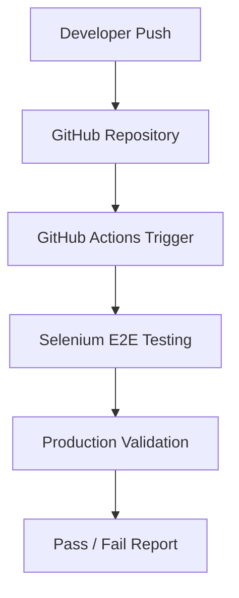

# React Deployment and Selenium E2E Testing Documentation

## Step 1 — Push Your React Project to GitHub
Inside your React project folder:

```bash
git init
git add .
git commit -m "Initial frontend upload"
git branch -M main
git remote add origin https://github.com/YOUR_USERNAME/YOUR_REPO.git
git push -u origin main
```

Replace `YOUR_USERNAME` and `YOUR_REPO` with your GitHub details.

---

## Step 2 — Install GitHub Pages Package
Inside the frontend project:

```bash
npm install gh-pages --save-dev
```

---

## Step 3 — Update package.json
Open `package.json`.

Add `homepage`:

```json
"homepage": "https://YOUR_USERNAME.github.io/YOUR_REPO",
```

Inside `scripts` add:

```json
"predeploy": "npm run build",
"deploy": "gh-pages -d build"
```

Example `package.json` scripts section:

```json
"scripts": {
  "start": "react-scripts start",
  "build": "react-scripts build",
  "predeploy": "npm run build",
  "deploy": "gh-pages -d build"
}
```

---

## Step 4 — Deploy React Project to GitHub Pages
Inside the frontend project folder run:

```bash
npm run deploy
```

This command:
* Builds the React application
* Creates a production build
* Uploads the build to GitHub Pages

---

## Step 5 — Enable GitHub Pages
1. Open your GitHub repository.
2. Go to: **Settings** → **Pages**
3. Under **Build and deployment**:
4. Select: **Source** → **Deploy from branch**
5. Choose: **Branch** → **gh-pages**
6. Click: **Save**

---

## Step 6 — Access the Live Application
After deployment, GitHub provides a live URL:
`https://YOUR_USERNAME.github.io/YOUR_REPO`

---

## Step 7 — Configure React Router for GitHub Pages
Replace:

```javascript
import { BrowserRouter } from 'react-router-dom';
```

With:

```javascript
import { HashRouter } from 'react-router-dom';
```

Then update:

```jsx
<BrowserRouter>
```

To:

```jsx
<HashRouter>
```

This prevents **404 Page Not Found** errors on page refresh or direct route access.

---

## Step 8 — Rebuild and Redeploy
After router changes, execute:

```bash
npm run build
npm run deploy
```

---

## Step 9 — Verify Deployment
Test that:
* Homepage loads correctly
* Login page works
* Page refresh functions normally
* Direct URL access does not trigger 404s

---

## Step 10 — Install Selenium E2E Testing Automation Dependencies
Inside your project folder run:

```bash
npm install selenium-webdriver mocha --save-dev
```

---

## Step 11 — Create Selenium Test Structure
Recommended directory structure:

```text
frontend/
│
├── selenium-tests/
│   ├── tests/
│   │   └── login.test.js
│   ├── package.json
```

---

## Step 12 — Add Stable IDs for Automation
Example of adding automation-friendly IDs to input controls and buttons:

```jsx
<Input id="email" />
<Input id="password" />
<Button id="login-button" />
```

This allows Selenium to locate elements reliably.

---

## Step 13 — Run Selenium Test Locally
Run the test command:

```bash
npm run login
```

This script:
* Opens a headless/headed Chrome browser instance
* Navigates to the login page
* Enters mock test credentials
* Validates dashboard redirection behavior

---

## Step 14 — Setup GitHub Actions
Create a workflow file under `.github/workflows/selenium-login.yml`.

GitHub Actions will automatically:
* Check out the repository code
* Install dependencies and build project
* Run E2E Selenium tests using a headless browser
* Report the pass/fail build statuses

---

## Step 15 — Automatic CI/CD Testing
Whenever code is pushed to your repository:

```bash
git push
```

GitHub Actions automatically triggers:
* Build validation checks
* Automated Selenium E2E tests
* Deployment verifications

---

## Final Architecture


This creates a modern frontend deployment and automation testing pipeline.